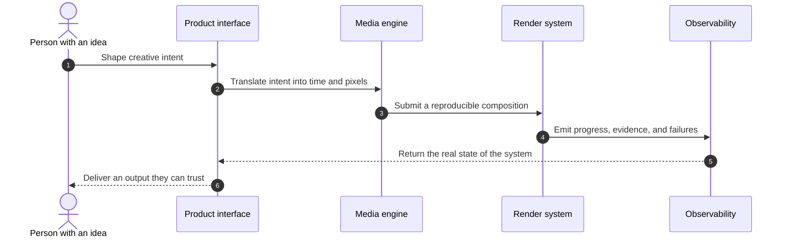

<p align="center">
  
</p>

```text
DOCUMENT  TY-CS-01       REV  A       STATUS  WORKING SYSTEM
```

## The interface is only one node.

I’m **Taylor Yates**, a full-stack engineer at **Spaceback**. I build creative
tools by treating product decisions, browser media, rendering, and operations
as one circuit. A change at any node can alter the final output.

### Trace a request through the system



<sub>The diagram above is rendered natively by GitHub from Mermaid source.</sub>

### Component index

| Ref | Component | Working material |
| :---: | --- | --- |
| `J1` | Interface | React, TypeScript, HTML, CSS, interaction design |
| `J2` | Media engine | WebCodecs, MediaSource, Canvas, WebGL |
| `J3` | Services | Rails, Node.js, PostgreSQL, Redis, queues |
| `J4` | Production | Rendering, AWS, Docker, CI, observability |
| `J5` | Feedback loop | Debugging evidence turned back into product judgment |

<details>
  <summary><code>EXPAND SERVICE NOTES</code></summary>
  <br />

  I’m happiest at the connections: where an editing interaction changes the
  render contract, where a production failure reveals an interface problem, or
  where a better system boundary makes a new creative action possible.
</details>

`CONTACT` [evantayloryates@gmail.com](mailto:evantayloryates@gmail.com)
· `SOURCE` [github.com/evantayloryates](https://github.com/evantayloryates)
